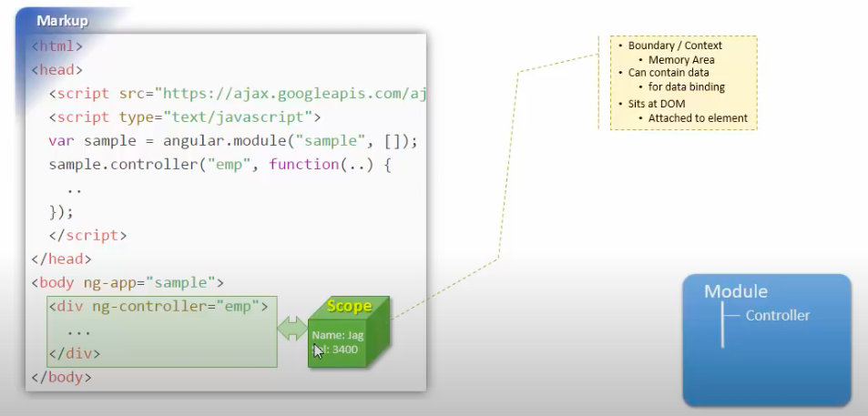
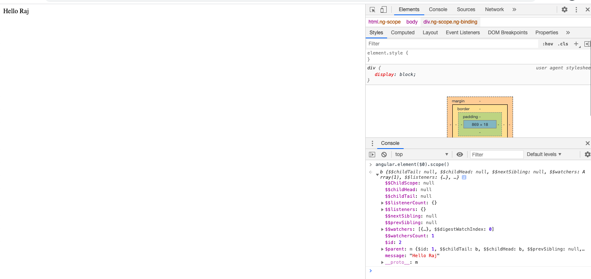
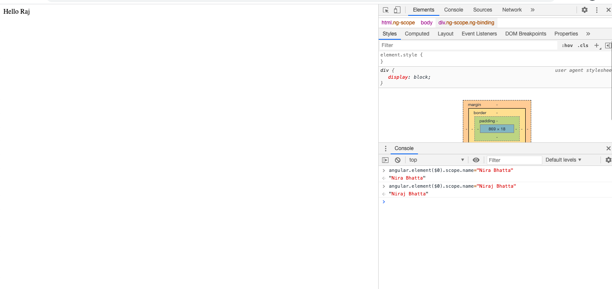

## What is scope and controller? ##
- Controller contains all the definition of the data as show below:


- Once data definition is defined inside controller, we must instatiate the controller to access the data such as:
```js
Emp emp=new Emp();
```
which is performed by ng-controller="emp"

```html
<div ng-controller="emp">
....        
</div>
```

- Now you can pass the value from controller to view using scope. Thus, define value inside controller as 
```js
//Step 1: Create a module
var myApp=angular.module("myModule",[]);

myApp.controller("emp", function($scope){
    $scope.message="Hello Raj";
});
```

- Now you can access the value inside view using
```html
<html ng-app="myModule">
<body>

    <div ng-controller="emp">
        {{message}}
    </div>
    

    <script src="https://ajax.googleapis.com/ajax/libs/angularjs/1.6.9/angular.min.js"></script>
    <script src="script/script.js"></script>
    
</body>
</html>
```

## How to inspect from browser? ##
- Goto chrome
- Inspect elements
- Console
- Type angular
- Type element($0) means give me angular representation of highlighted elements
- Type scope() means give me scope
- If we expand b then we can see message such as "Hello Raj"



## How to modify value of scope from Chrome console ? ##



- Once this step is complete:


