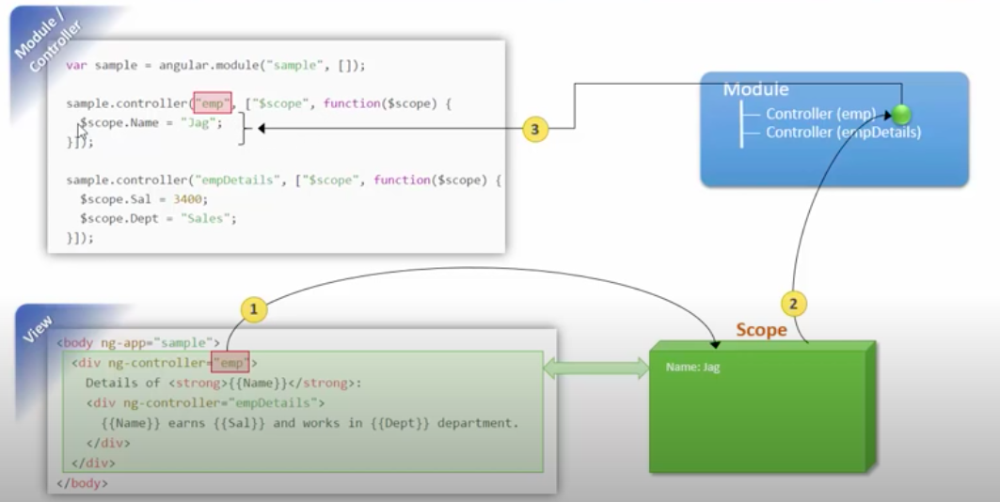

## What is scope scope inheritance? ##
The $scope object used by views in AngularJS are organized into a hierarchy. There is a root scope, and the $rootScope can has one or more child scopes. Each controller has its own $scope (which is a child of the $rootScope), so whatever variables you create on $scope within controller, these variables are accessible by the view based on this controller.


## Example ##
- View page

```html
<html ng-app="myModule">
<body>

    <div ng-controller="emp">
        {{name}}
        <div ng-controller="empDetails">
            {{address}}
            
        </div>
    </div>
    

    <script src="https://ajax.googleapis.com/ajax/libs/angularjs/1.6.9/angular.min.js"></script>
    <script src="script/script.js"></script>
    
</body>
</html>
```

- Script page
```js
//Step 1: Create a module
var myApp=angular.module("myModule",[]);

myApp.controller("emp", [$scope, function($a){
    $a.name="Raj Bhatta"
}]);


myApp.controller("empDetails", [$scope, function($detailsScope){
    $detailsScope.address="British Columbia Canada"
}]);
```

